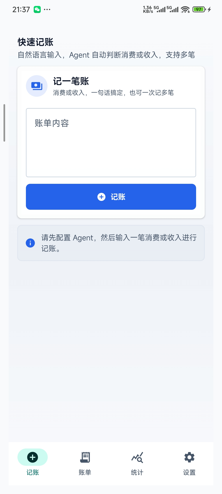
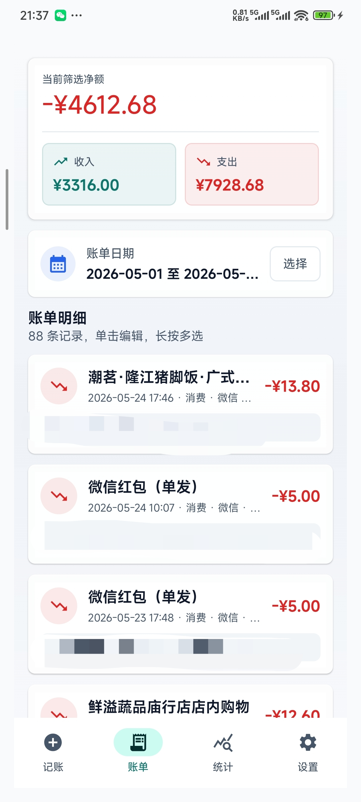
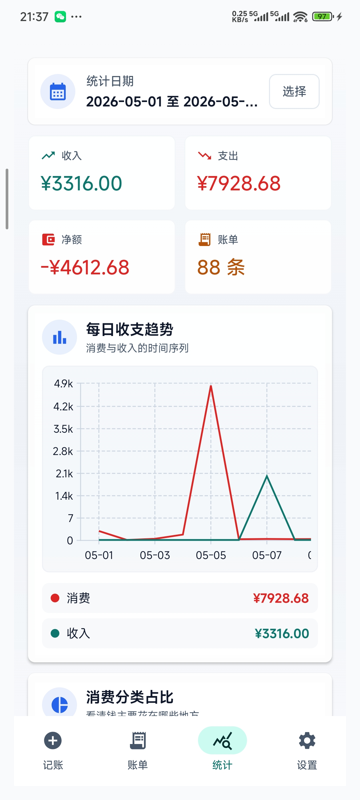
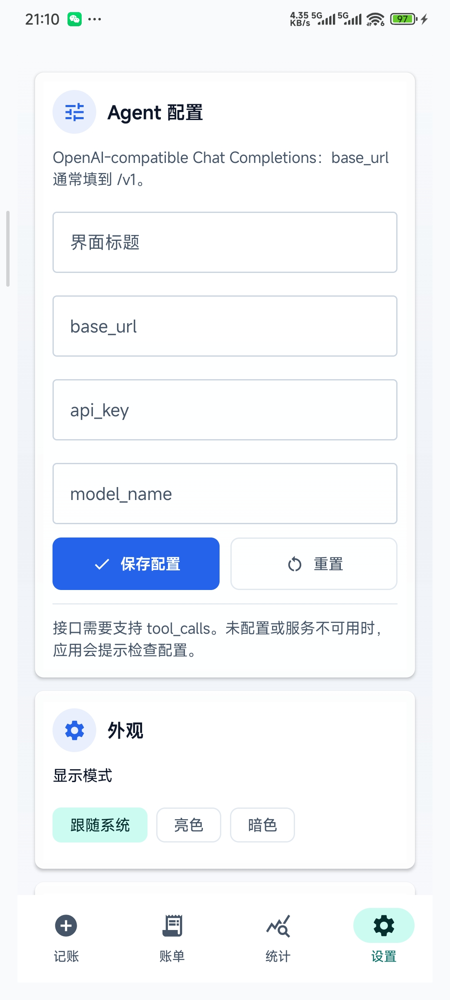

# AgenticLedger

- `AgenticLedger` 是一个 **LLM驱动** 的 Android 文本记账应用。用户可以输入自然语言消费或收入，例如“我刚刚用微信支付 28 元买咖啡”或“今天银行卡到账 8000 元工资”，应用会通过可配置的 Agent 解析金额、渠道、分类/收入类型、事项和日期时间，并把账单保存在本地 SQLite。

- 支持导入 [**微信**](/docs/如何导出微信账单.md) / [**支付宝**](/docs/如何导出支付宝账单.md) 的账单文件

- **图表可视化界面**：消费/收入分布一目了然

## 安装

到 [Release](/releases) 下载 `app-release.apk` 即可安装

## 前提条件

你需要支持`chat-compatible`接口的**LLM供应商**

## 最低支持

本项目的开发、调试都是在 `Android 12` 的设备上进行，理论是支持12+，低于此版本的设备不保证可用或通过打补丁后可用。

## 预览

### 记账



### 账单



### 统计



### 配置

1. 在【设置】页面配置好`界面标题` `base_url` `api_key` `model_name`
2. 点击【√保存配置】


## 本地开发

### 环境要求

- Android CLI：已验证版本 `0.7.15433128`
- Android SDK：项目创建时使用 `platforms/android-36`
- 最低系统版本：Android 12（`minSdk 31`）
- Gradle Wrapper：使用项目内置 `gradlew` / `gradlew.bat`
- JDK：需满足 Android Gradle Plugin 的运行要求

### 常用命令

在项目根目录执行

#### 构建Debug包

```powershell
.\gradlew.bat assembleDebug
```

可在app\build\outputs\apk\debug\app-debug.apk找到产物

#### 构建Release包

- 推送v开头的tag到github会自动在actions执行构建，构建完成可以在Release看到产物
- 前提条件是你需要在 `Settings -> Secrets and variables -> Actions -> Secrets` 下准备4个变量
    1. KEYSTORE_BASE64
    2. KEYSTORE_PASSWORD
    3. KEY_ALIAS
    4. KEY_PASSWORD

#### 运行单元测试

```powershell
.\gradlew.bat test
```

#### Debug构建

```powershell
.\gradlew.bat assembleDebugKotlin
```

#### 查询 Android 文档

```powershell
android docs search "Jetpack Compose"
```

## 目录说明

- `app/`：Android 应用模块。
- `app/src/main/java/com/example/androidproject/`：应用主代码。当前包名仍保留模板默认值，后续如需正式改包名请同步调整源码目录、`namespace` 和 `applicationId`。
- `app/src/main/java/com/example/androidproject/data/`：收支账单模型、SQLite 持久化仓储、加密 ZIP 备份导入导出和 OpenAI-compatible Agent 解析实现。
- `app/src/main/java/com/example/androidproject/ui/main/`：文本消费/收入记账、底部导航、账单日期区间筛选、Dashboard 统计图、长按编辑/删除、Agent 配置、导入配置遮罩锁定、主题模式、数据备份和主界面视觉组件。
- `app/src/main/res/`：应用资源文件。
- `app/src/test/`：本地单元测试。
- `app/src/androidTest/`：设备或模拟器上的仪器测试。
- `gradle/`：Gradle Wrapper 与版本目录。
- `AGENTS.md`：协作与维护约定。
- `CHANGELOG.md`：项目变更记录。
- `技术文档.md`：技术栈、结构和扩展说明。
- `关键链路.md`：项目关键操作流程。

## 文档维护

代码、构建、运行或目录结构发生变化时，请同步维护对应文档，并在 `CHANGELOG.md` 记录变更。

## Agent 配置

应用内“设置”页支持配置：

- `界面标题`：主界面显示的应用标题。
- `base_url`：OpenAI-compatible Chat Completions 基础地址，通常填到 `/v1`，例如 `https://api.openai.com/v1`。
- `api_key`：接口密钥，仅保存在本机应用私有 SQLite。
- `model_name`：要调用的模型名。

远程接口需要支持 `tool_calls`。如果未配置或远程调用失败，应用会提示检查配置和服务状态，不会使用本地规则兜底。

如果设置通过备份 ZIP 导入，`base_url`、`api_key` 和 `model_name` 会在设置页用 `*` 遮罩并禁用输入，避免泄露分享者的配置。可通过“重置”清空界面标题和 Agent 配置并恢复可编辑状态。

## 数据备份

设置页支持导出和覆盖导入 SQLite 数据：

- 导出可选择账单数据、设置或两者全选。
- 仅导出账单数据时可选择账单日期范围。
- 导出文件为 `.zip`，其中数据内容使用 AES-GCM 对称加密。
- 导入 `.zip` 时应用会自动解压解密；导入前会提示覆盖风险，导入文件中包含的账单或设置会覆盖当前对应数据。

## 账单展示

账单页同时展示消费和收入。消费金额使用 `-` 前缀，收入金额使用 `+` 前缀和绿色强调；顶部概览卡按收入减消费展示当前日期筛选净额，并同步展示收入、支出和筛选日期。

## 统计

底部 `统计` 页复用账单页的日期范围，按当前筛选后的 SQLite 账单实时统计。页面展示收入、支出、净额和账单数 KPI 卡片，并提供每日收支双折线、消费分类饼图、收入分类饼图、渠道收支双柱状图和收入支出占比饼图。

## 界面体验

主界面采用 Material 3 主题、克制的蓝/绿/琥珀强调色和高对比浅/深色配色。底部导航使用 Material 图标，页面切换包含滑动、淡入淡出和轻微缩放，主要按钮和账单卡片提供按压反馈，图表区域使用统一卡片、图例和留白。

## 显示模式

设置页支持手动选择显示模式：

- 跟随系统
- 亮色
- 暗色
